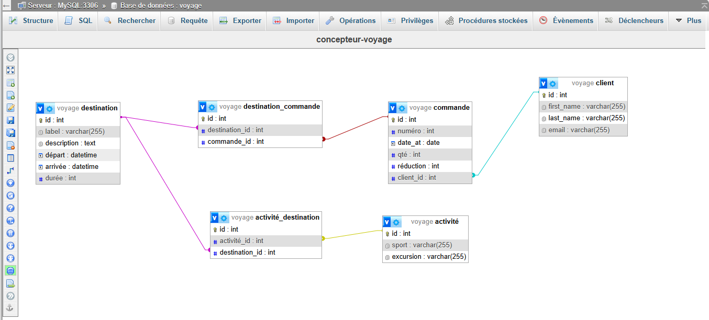

# Travail colloboratif<br>
* J'ai travaillé sur la documentation SQL avec [**@Anais**](https://github.com/Nanas63), un grand merci 😉
* [**@Noémie**](https://github.com/NoemieDML) à travailler aujourd'hui sur le site web (pas finaliser)

## Procédure d'installation de git clone pour la documentation SQL

#### Cloner le dépôt GitHub :
- Ouvrez l'invite de commande <b>(cmd)</b> ou <b>Git Bash.</b><br>

```bash
1. Commencez par cloner le dépôt sur votre machine locale :<br>
2. Une fois le dépôt cloné, il est nécessaire d'installer les dépendances du projet.<br>
3. Pour ce faire, exécutez la commande suivante dans le terminal à la racine du projet :<br>
```

```bash
git clone https://github.com/fannysaez/Documentation-SQL.git
cd Documentation-SQL
```

## Table des matières 

📂 Documentation-SQL
   - [Présentation de SQL](introduction.md)  
      - [Guide d'installation et d'utilisation de WAMP](installation.md) 
      - [Guide d'utilisation de PhpMyAdmin](phpmyadmin.md) 
      - [Explication sur les bases de données](bases-de-donnees.md) 
      - [Listing des commandes SQL](commandes-SQL.md) 
      - [Exemples de requêtes pratiques](exemples-requêtes.md) 

📂 assets
   - [](assets/schema-voyage-db.png)


<br><br>

# Documentation SQL

### 🗂️ Structure de la documentation SQL
```bash
📂  Documentation-SQL
│── 📄 README.md         --> Introduction et guide d'utilisation
│── 📄 introduction.md   --> Présentation de SQL
│── 📄 installation-wamp.md  --> Guide d'installation et d'utilisation de WAMP
│── 📄 phpmyadmin.md     --> Guide sur l'utilisation de phpMyAdmin
│── 📄 bases-de-donnees.md  --> Explication sur la base de données
│── 📄 commandes-SQL.md      --> Liste des commandes SQL principales
│── 📄 exemples-requêtes.md       --> Exemples de requêtes pratiques
│── 📂 assets        --> Dossier pour les images, liens, ou fichiers annexes
│   ├── 🖼️ schema-voyage-db.png   --> Exemple de schéma de la base de données
│   ├── 🖼️ Lancer WAMP puis phpmyadmin.png   --> Exemple pour Lancer Wamp et PhpMyAdmin
│   ├── 🖼️ icone-wampserver-vert.png   --> Exemple d'icône réussi pour wampserver
│   ├── 🖼️ connexion-phpmyadmin.png   --> Exemple pour se connecter à PhpMyAdmin
│   ├── 🖼️ interface-phpmyadmin.png   --> Exemple d'interface graphique de PhpMyAdmin
│   ├── 🖼️ cle-primaire.png   --> Exemple dans la base de données pour la clé primaire
│   ├── 🖼️ clés-etrangeres.png   --> Exemple dans la base de données pour les clés étrangères
```

[Suivant](introduction.md) 