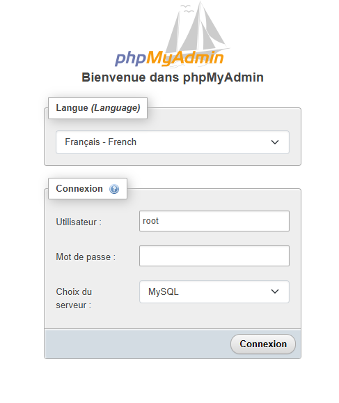

## Guide d’installation d'utilisation de WAMP sur Windows 🖥️<br>

### 📌 Qu'est-ce que WAMP ?<br>
WAMP est un acronyme pour (*Windows, Apache, MySQL, PHP*).<br>
Il s’agit d’un environnement de développement web qui permet de créer et de tester des applications web localement sur un ordinateur Windows. <br>

Ce guide va t’aider à installer WAMP sur ton système.<br>

### 🚀 Étapes d’installation<br>
#### 1. Télécharger WAMP<br>

Allez sur le site officiel de WAMP pour télécharger la dernière version du logiciel :<br>
   - Rendez-vous sur le site officiel : [https://www.wampserver.com/](https://www.wampserver.com/)<br>  

Assurez-vous de télécharger la version compatible avec votre version de Windows (32 ou 64 bits).<br>

#### 2. Installer WAMP<br>
Une fois le fichier téléchargé, suivez ces étapes pour installer WAMP :<br>

	1.	Lancez le fichier d’installation.
	2.	Choisissez l’emplacement d’installation : Par défaut, il sera installé dans C:\wamp ou C:\wamp64 (selon votre version).
	3.	Sélectionnez les options de configuration : Choisissez les versions de PHP et MySQL souhaitées.
	4.	Terminez l’installation.

#### 3. Lancer WAMP<br>
Une fois l’installation terminée, vous pouvez lancer WAMP. Vous devriez voir une icône WAMP dans la barre des tâches (en bas à droite de votre écran). Si l’icône est **verte**, cela signifie que WAMP fonctionne correctement. <br>


   - Clique gauche sur l'icone **verte**<br><br>


``` bash 
Allez sur PhpMyAdmin
puis de nouveaux cliquez sur phpMyAdmin 5.2.1
```

#### 4. Accéder à phpMyAdmin<br>
WAMP inclut phpMyAdmin, un outil de gestion de bases de données MySQL via une interface web. <br>
Pour y accéder, tapez simplement dans votre navigateur :



``` bash 
http://localhost/phpmyadmin
``` 

* Entrez le **nom d’utilisateur** `root` 
* Le **mot de passe** pour accéder à votre base de données `vide`.
<br>


[Précédent](introduction.md) | [Suivant](phpmyadmin.md) <br>
